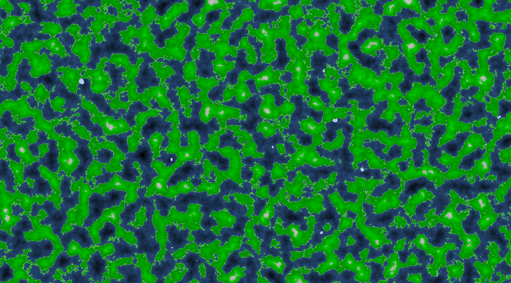

# 2D Terrain Generation

A 2D Terrain Generating Script Written In Python!

## How It Works

It uses **Perlin Noise** to generate a map of values from **0 to 1**. Then we use this values **converting them to the height** of a piece of terrain. Based on the height of the terrain it **modifies the color of the ground** giving the impression of height!

## How To Use It

First of all get the libraries needed by using `pip install -r requirements.txt` in your terminal! Then just open **main.py** and run it!  
  
### Creating a **venv**

I recommend creating a **venv** for this project, you can do so by using this command `python -m venv myenv` and then activate it by using this command `myenv\Scripts\activate`! Now you can use this **venv** to **install the libraries on this project!**

## License

This project is licensed under the MIT License. See the [LICENSE](./LICENSE) file for details.

### Compliance with License

If you use or distribute this project, you agree to comply with the terms of the above-mentioned license. Specifically, you must:

- Include the original copyright notice in any copy of the project or substantial portion of it.
- Indicate any changes made to the project.
- Provide a copy of the license with the project.

Please refer to the [LICENSE](./LICENSE) file for more information on your rights and obligations under the terms of the MIT License.

## From The Creator

### Why I Did Make This Project

Like many of you guys I like to challenge my self and make cool projects!  
In this case I specifically made this project because I was inspired by the **Terrain Generation of Minecraft**

### How To Make This Project Cooler

If you want to make **more features** to this code I recommend trying to **make biomes**! You can do this using the same method I used to generate the Map, you can make **two new Perlin Noise maps** for the **Temperature and Humidity**.  By comparing this two values you can determine the **Biome of each peace of terrain**!

## End Result

#### Notice That You Can Change Different Variables Of The Perlin Noise Alghorithm To Get Different Results!  

### **Made by Dauwt©**